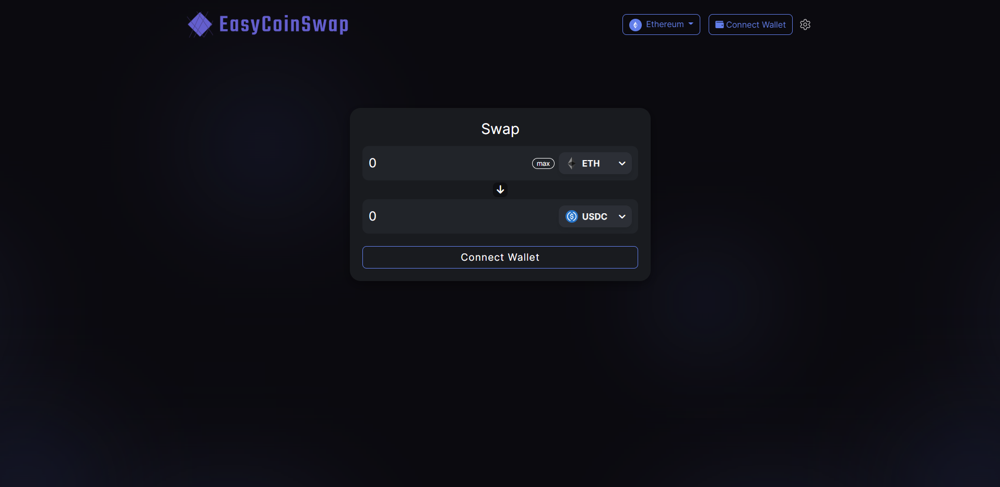

# EasyCoinSwap - Simple DEX aggregator
A simple DEX aggregator that checks multiple DEX's (like Uniswap or Pancakeswap) before choosing the best price for a token swap.  
Created with Angular, Node.js & Express.

## Setting up the project
You need to have node.js and npm installed to be able to run this project locally.  
  
Change into the directory and run "npm install" in your console after cloning this project.  
Then run "npm run dev" or "node index.js" and open your browser with following url: "localhost:3000"  
  
That's it. Now you should be able to see the website.

## Preview
